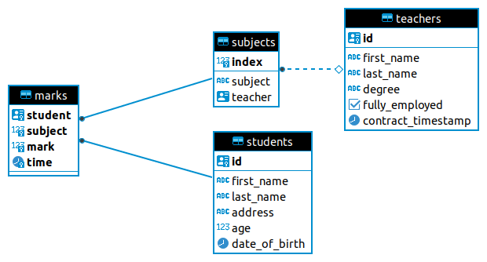

# rust-diesel-examples
Rust Diesel PostgreSQL handling examples

When I used Diesel with PostgreSQL for the first time, I have faced lack of complete working code examples. Here I have tried to assemble some convenient example use-cases in one place.


## Setup


Install diesel cli:
```shell
cargo install diesel_cli --no-default-features --features postgres
```

Create a .env file at the root of the project and set the database URL:

```shell
echo DATABASE_URL=postgres://<postgres_username>:<postgres_password>@<postgres_host>:<postgres_port>/school > .env
```

Perform migrations. At this step Rust schema is also automatically generated and printed to the file defined in `diesel.toml`
```shell
diesel migration run
```


## Execute

Run example binary that will query, insert and update tables
```shell
cargo run
```


## Tables diagram

